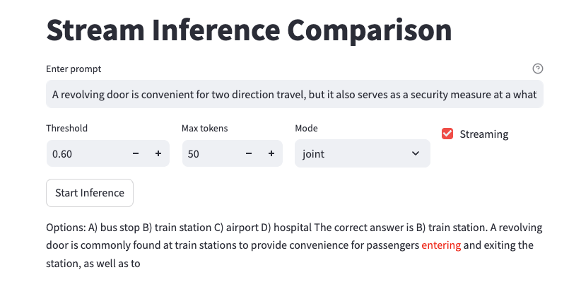

# 🔀 Token-Level Routing for Edge Inference

> Efficient collaborative decoding between edge-deployed small models and cloud-based large language models.

## Demo


## 🧠 Overview

This project implements **Token-Level Routing**, a novel **collaborative inference system** where a small on-device model performs the majority of decoding, but selectively routes **critical tokens** to a cloud-hosted **large language model (LLM)**.

This method drastically reduces resource consumption while maintaining high response quality — perfect for **edge devices** like smartphones or IoT chips.

📄 Read our paper: [Token-Level Routing Inference System for Edge Devices](https://arxiv.org/abs/your-paper-link)

🎥 Watch the demo:  
[](https://www.youtube.com/watch?v=Tr_ziV_PJT4)

## 🚀 Key Features

- ⚡ **Efficient**: >60% accuracy boost by routing just ~7% tokens to LLM.
- 🌐 **Edge-Cloud Collaborative**: Small model on device + large model in cloud.
- 🧭 **Token-Level Routing**: Fine-grained, confidence-based decision-making.
- 📱 **Deployable**: Supports ONNX inference on mobile and laptop.
- 🖥️ **Backend-ready**: Uses SGLang for LLM serving with extensible kv-cache.

## 📐 Architecture

```text
+-------------+           +-------------+           +-------------+
|  User Input |--Prompt-->|  SLM (ONNX) |--Tokens-->|   Router     |
+-------------+           +-------------+           +-------------+
                                              |
                          Tokens with low confidence |
                                              v
                                    +------------------+
                                    | LLM (Server-side)|
                                    +------------------+
